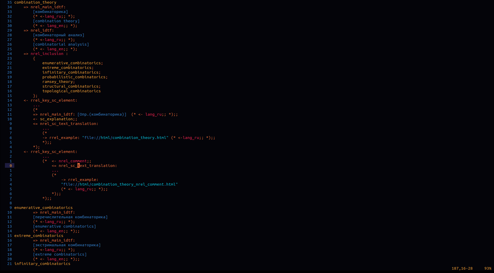

# OSTIS syntax highlighting for Vim and Neo-vim editors

[](https://github.com/PlagaMedicum/ostis-syntax.vim/blob/master/LICENSE)

## Examples

*Example of SCP highlighting:*


*Example of SCS highlighting:*



Note, that colour theme depends on your vim configuration.

## Installation

### Plugin managers

```viml
" vim-plug
Plug 'PlagaMedicum/ostis-syntax.vim'

" Vundle
Plugin 'PlagaMedicum/ostis-syntax.vim'

" NeoBundle
NeoBundle 'PlagaMedicum/ostis-syntax.vim'
```

### Manual

Run [./install.sh](install.sh) to copy files in `~/.vim`.
