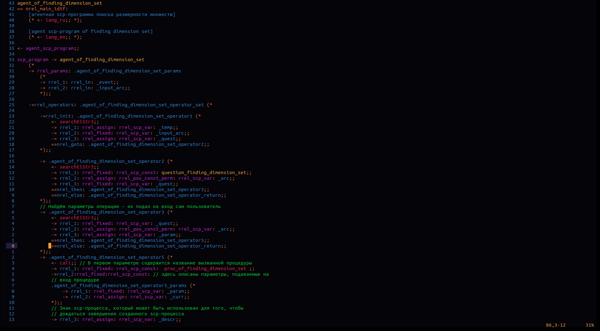

# OSTIS syntax highlighting for Vim editor

[](https://github.com/PlagaMedicum/ostis-syntax.vim/blob/master/LICENSE)

## Examples

*Example of SCP highlighting:*



*Example of SCS highlighting:*


Note, that colour theme depends of your vim configuration.

## Installation

### Plugin managers

```viml
" vim-plug
Plug 'PlagaMedicum/ostis-syntax.vim'

" Vundle
Plugin 'PlagaMedicum/ostis-syntax.vim'

" NeoBundle
NeoBundle 'PlagaMedicum/ostis-syntax.vim'
```

### Manual

Run [./install.sh](install.sh) to copy files to `~/.vim`.
